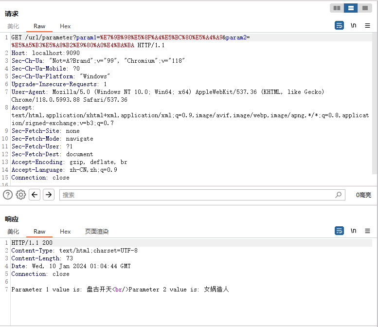
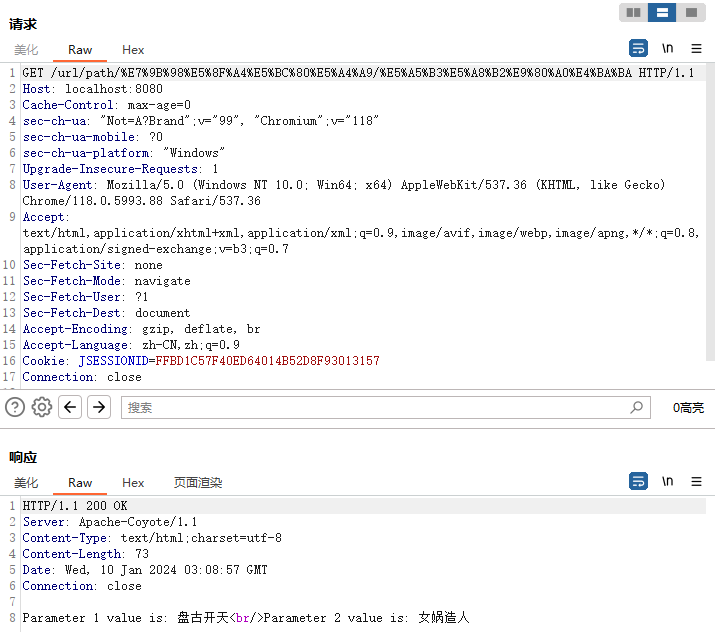
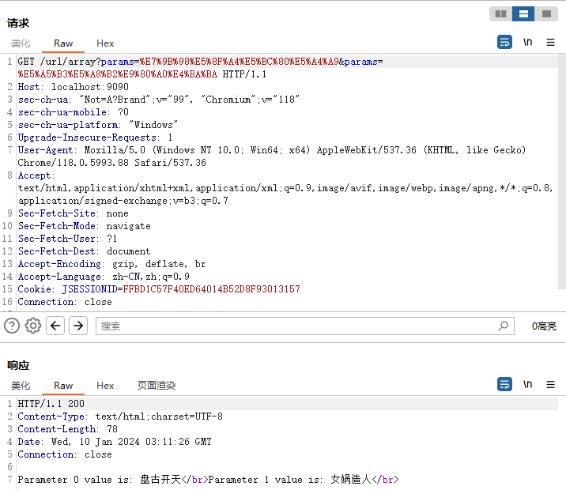
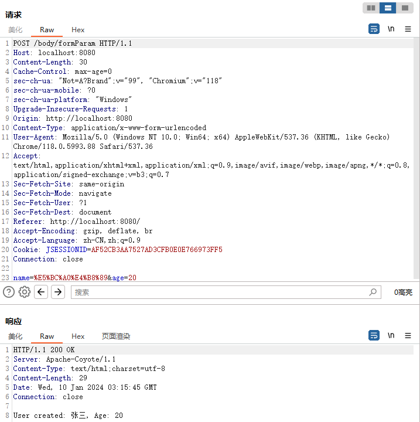
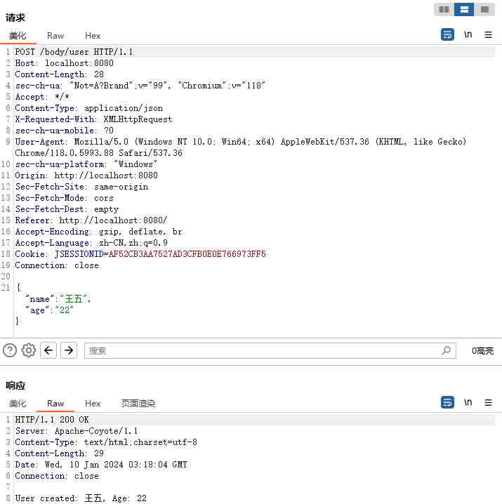
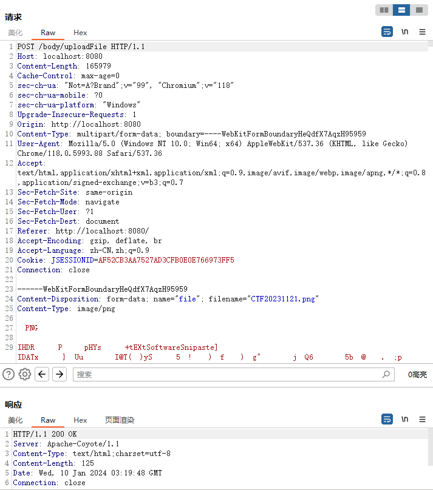
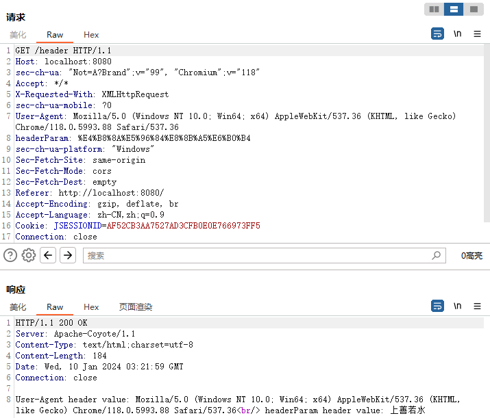

# hi-http
http传参例子


## 使用说明

仓库包含两个项目，请使用idea分别打开hi-http-servlet和hi-http-springboot目录


## 请求方法

| Request method | Request has payload body | Response has payload body | Safe | Idempotent | Cacheable |
| -------------- | ------------------------ | ------------------------- | ---- | ---------- | --------- |
| GET            | Optional                 | Yes                       | Yes  | Yes        | Yes       |
| HEAD           | Optional                 | No                        | Yes  | Yes        | Yes       |
| POST           | Yes                      | Yes                       | No   | No         | Yes       |
| PUT            | Yes                      | Yes                       | No   | Yes        | No        |
| DELETE         | Optional                 | Yes                       | No   | Yes        | No        |
| CONNECT        | Optional                 | Yes                       | No   | No         | No        |
| OPTIONS        | Optional                 | Yes                       | Yes  | Yes        | No        |
| TRACE          | No                       | Yes                       | Yes  | Yes        | No        |
| PATCH          | Yes                      | Yes                       | No   | No         | No        |


## 传参方式

### URL参数

#### 查询参数

在HTTP请求中，参数直接附加在URL的末尾，形如`?key1=value1&key2=value2`。这种方式适合传递少量的数据，常用于查询、筛选、搜索等场景。

```
https://example.com/api?param1=value1&param2=value2
```


- curl测试

```sh
curl -X GET 'http://localhost:9090/url/parameter?param1=盘古开天&param2=女娲造人'
```


- HTTP报文




#### 路径参数

有些情况下，参数直接嵌入在URL的路径中，用于标识资源或者执行特定操作。例如：`/users/{id}`，其中`{id}`就是路径参数，代表特定用户的ID。


```
https://example.com/api/resource/{id}
```

其中的`{id}`是一个占位符，可以被具体的值替代。


- curl测试

```sh
curl -X GET 'http://localhost:9090/url/path/盘古开天/女娲造人'
```


- HTTP报文

 


#### 数组参数

```sh
http://localhost:8080/array?numbers=1&numbers=2&numbers=3&numbers=4
http://localhost:8080/array?numbers=1,2,3,4
```

第1种使用重复参数传递数组，大部分WEB开发框架都支持

第2种使用逗号形式分隔数组元素，部分WEB框架支持，也可以自己写代码接收后转数组


- curl测试

```sh
curl -X GET 'http://localhost:9090/url/array?params=盘古开天&params=女娲造人'
curl -X GET 'http://localhost:9090/url/array?params=盘古开天,女娲造人'
```


- HTTP报文

 


### 请求体

在POST请求中，参数通常放在请求体中传输，不像GET请求直接暴露在URL上。这允许传输大量的数据，比如表单数据、JSON、XML等格式的数据。


#### 表单数据

通过表单提交，参数以键值对的形式放在请求体中。


- curl请求测试

```sh
curl -X POST -H "Content-Type: application/x-www-form-urlencoded" -d "name=John&age=25" http://localhost:9090/body/formParam

curl -X POST -H "Content-Type: application/x-www-form-urlencoded" -d "name=John&age=25" http://localhost:9090/body/formModel
```


- HTTP报文

 


#### JSON数据

可以使用HTTP请求将参数以JSON格式放在请求体中发送给服务器。


- curl请求测试

```sh
curl -X POST -H "Content-Type: application/json" -d '{"name":"John","age":25}' http://localhost:9090/body/user
```


- HTTP报文

 


#### 多部分数据（Multipart Data）

用于在单个HTTP请求中发送不同类型的数据，比如同时上传文本和图像文件。


- curl请求测试

```sh
curl -X POST -H "Content-Type: multipart/form-data" -F "file=@/path/to/your/file" http://localhost:9090/body/uploadFile
```


- HTTP报文

 


### HTTP头部

有时候参数可以作为HTTP头部的一部分进行传递，有些自定义的API或者安全方面的需求可能会使用这种方式传递参数。


- curl请求测试

```sh
curl -X GET -H "User-Agent: MyCustomUserAgent" http://localhost:9090/header
```


- HTTP报文

 
